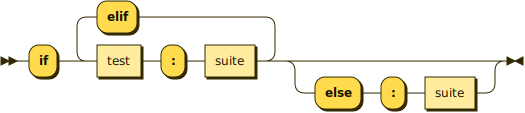
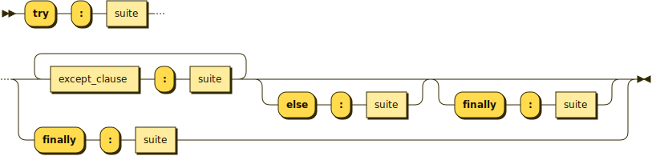

# RR - Railroad Diagram Generator

RR is a generator of syntax diagrams, also known as railroad diagrams. It is
a self-contained tool with both a browser-based GUI and a batch mode.

Besides generating diagrams from EBNF rules, RR also can perform some grammar transformation, e.g. factorization
and elimination of direct recursion. To some extent this transforms BNF to EBNF, yielding more compact diagrams.

# Examples

Here are two examples of generated diagrams (taken from the [Python grammar][PYTHON]):

**if_stmt:**



**try_stmt:**



# Grammar syntax

RR accepts grammars in [W3C-style EBNF][W3C-EBNF]. Some other representations, including
some parser generator input notations, can be converted to W3C-style using
the [ebnf-convert][CONVERT] Grammar Converter (note: IPv6-only). This tool
is also available [on GitHub][CONVERT-GITHUB].

# Distribution

RR comes as a .zip, containing a .war file. The .war file can be deployed
in servlet containers like Tomcat or Jetty for serving the GUI. This makes up the webapp
that is running on the original website, <https://www.bottlecaps.de/rr/ui>
(note: IPv6-only, see [Links][LINKS] below for alternatives).

The .war file is a Java "executable war", i.e. it can also be started
standalone from command line. Two different tasks can be performed in standalone mode:

- serving the GUI, e.g.

```bash
   java -jar rr.war -gui
```
- batch diagram generation, e.g.

```bash
   java -jar rr.war grammar.ebnf
```

For listing the full set of available options, run

```bash
   java -jar rr.war
```
without further command line arguments.

## Building RR
For building RR, JDK 11 (or higher) must be available. In the
project folder, run this command to build the distribution .zip file:

```bash
gradlew
```

## Thanks

This project makes use of
  * [Saxon-HE][SAXON],
  * [TagSoup][TAGSOUP],
  * [Apache Batik][BATIK],
  * [Ace Editor][ACE],
  * [Gradle][GRADLE], and
  * [Gradle-License-Report][GRADLE-LICENSE-REPORT].

## License

RR is released under the [Apache 2 License][ASL].

## Links

The official website for RR is <https://www.bottlecaps.de/rr/ui> (note: IPv6-only).

Thanks to [Vinay Sajip][VINAY], RR also runs on <https://rr.red-dove.com/ui> (IPv4 accessible).

[ASL]: http://www.apache.org/licenses/LICENSE-2.0
[PYTHON]: https://docs.python.org/3/reference/grammar.html
[W3C-EBNF]: http://www.w3.org/TR/2010/REC-xquery-20101214/#EBNFNotation
[CONVERT]: http://www.bottlecaps.de/ebnf-convert/
[CONVERT-GITHUB]: https://github.com/GuntherRademacher/ebnf-convert
[SAXON]: http://www.saxonica.com/products/products.xml
[TAGSOUP]: https://search.maven.org/artifact/org.ccil.cowan.tagsoup/tagsoup/1.2.1/jar
[BATIK]: https://xmlgraphics.apache.org/batik/
[ACE]: https://ace.c9.io/
[GRADLE]: https://gradle.org/
[GRADLE-LICENSE-REPORT]: https://github.com/jk1/Gradle-License-Report
[VINAY]: https://github.com/vsajip
[LINKS]: #links
